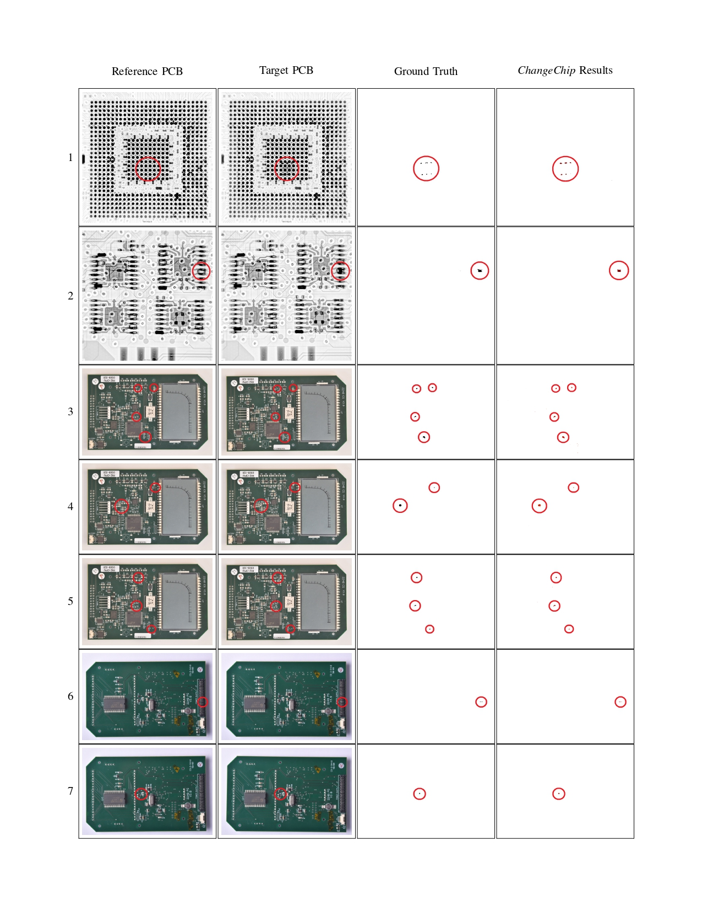
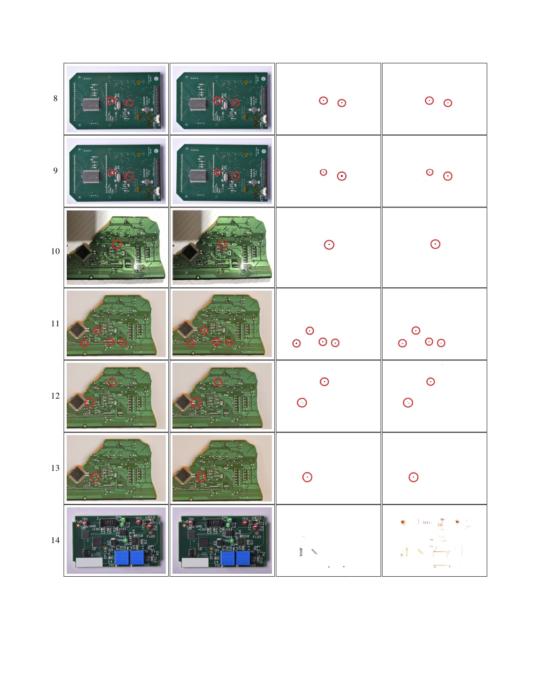

# ChangeChip


*ChangeChip* was developed to detect changes between an inspected PCB image and a reference (golden) PCB image, in order to detect defects in the inspected PCB.\
The system is based on Image Processing, Computer Vision and Unsupervised Machine Learning.\
*ChangeChip* is targeted to handle optical images, and also radiographic images, and may be applicable to other technologies as well.\
We note that *ChangeChip* is not limited to PCBs only, and may be suitable to other systems that require object comparison by their images.
The workflow of *ChangeChip* is presented as follows:


## Requirements:
- Download the DEXTR model (for the optinal cropping stage):
```
cd DEXTR/models/
chmod +x download_dextr_model.sh
./download_dextr_model.sh
cd ../..
```
- Conda Requirements:

Create a new conda environment with the following packages.
```
conda install pytorch torchvision -c pytorch
conda install numpy scipy matplotlib
conda install opencv pillow scikit-learn scikit-image
conda install keras tensorflow
```
## Running:
- Run the following command under the conda environment with your spesific directory and images paths, and change the values of the system parameters, if needed.
```
python main.py -output_dir OUTPUT_DIR 
-input_path INPUT_IMAGE.JPG 
-reference_path REFERENCE_IMAGE.JPG 
-n 16 
-window_size 5 
-pca_dim_gray 3
-pca_dim_rgb 9
-resize_factor 1
-lighting_fix
-use_homography
-save_extra_stuff
```
# CD-PCB
As part of this work, a small dataset of 20 pairs of PCBs images was created, with annotated changes between them. This dataset is proposed for evaluation of change detection algorithms in the PCB Inspection field. The dataset is available [here](https://drive.google.com/file/d/1b1GFuKS88nKaH-Nfx2XmlhwulUxMwwBA/view?usp=sharing).

---

#### Example of pairs from CD-PCB, the ground truth changes and *ChangeChip* results according to the parameters described in the Results section in the paper. 
#### The red circles are for easy identification by the reader.



